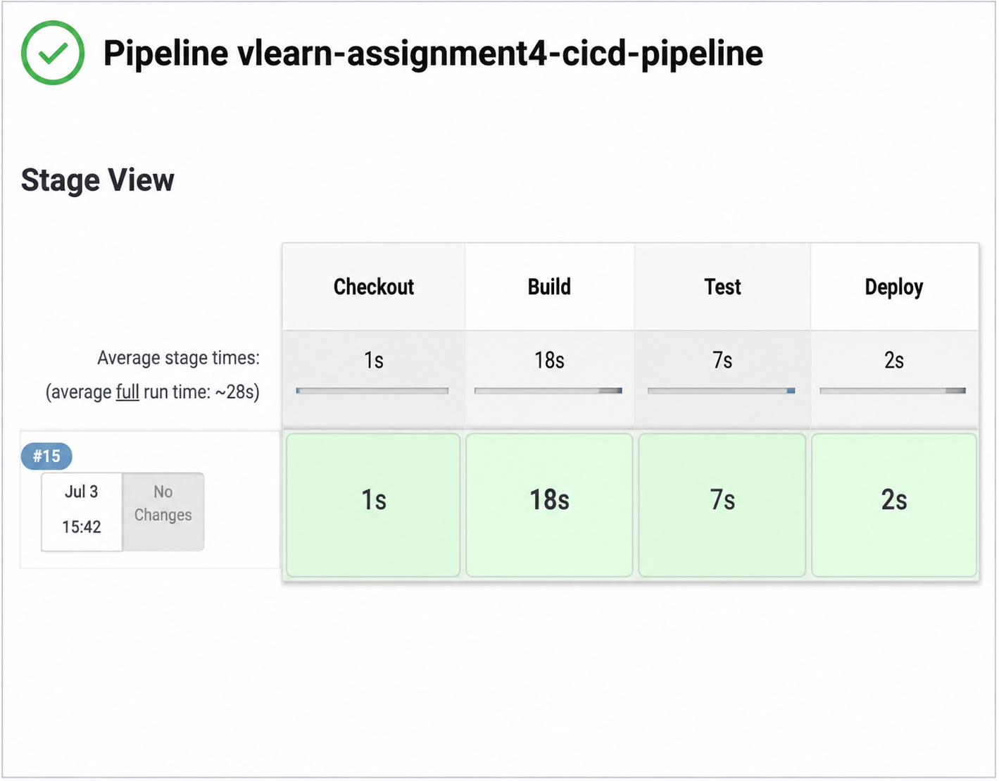

# Flask Practice - CI/CD Pipeline using Jenkins & GitHub Actions

## Overview

This project demonstrates a complete Continuous Integration and Continuous Deployment (CI/CD) implementation for a Flask application using both **Jenkins** and **GitHub Actions**.

The pipeline automatically performs the following tasks:

- Checkout source code
- Install Python dependencies
- Run unit tests using pytest
- Build the application
- Deploy to a staging environment
- Send notifications on build success/failure (Jenkins)
- Deploy to production on GitHub Release

---

# Technologies Used

- Python 3.11
- Flask
- Pytest
- Jenkins
- GitHub Actions
- GitHub Webhooks

---

# Jenkins CI/CD Pipeline

## Pipeline Stages

1. Checkout
2. Build
3. Test
4. Deploy

### Build Stage

- Creates Python virtual environment
- Installs project dependencies
- Installs pytest

### Test Stage

- Executes unit tests using pytest.

### Deploy Stage

- Deploys the application to the staging directory.

---

## Jenkins Pipeline Screenshot

### Stage View



---

## Jenkins Trigger

The Jenkins pipeline is automatically triggered whenever changes are pushed to the **main** branch using a GitHub Webhook.

---

## Jenkins Notifications

Email notifications are configured using the **Email Extension Plugin**.

Notifications are sent for

- Successful Builds
- Failed Builds

---

# GitHub Actions Workflow

The GitHub Actions workflow is located at

```
.github/workflows/ci-cd.yml
```

The workflow executes the following jobs:

- Install Dependencies
- Run Tests
- Build
- Deploy to Staging
- Deploy to Production

---

## Deployment Rules

### Staging

Triggered when code is pushed to

```
staging
```

branch.

### Production

Triggered whenever a Release Tag is created.

Example

```
v1.0.0
```

---

# Jenkins Pipeline

```
Checkout
     │
     ▼
 Build
     │
     ▼
 Test
     │
     ▼
Deploy
```

The Stage View shown below illustrates a successful pipeline execution where each stage completed successfully.

## Jenkins Pipeline Stage View

<p align="center">
  
</p>

The green boxes indicate that all pipeline stages—**Checkout**, **Build**, **Test**, and **Deploy**—completed successfully. This confirms that the application passed all validation steps and was automatically deployed to the staging environment.

---

# GitHub Actions Workflow

```
Push to main
        │
        ▼
 Install Dependencies
        │
        ▼
     Run Tests
        │
        ▼
      Build
        │
        ▼
Push to staging
        │
        ▼
 Deploy to Staging

Release Tag
        │
        ▼
Deploy to Production
```

---

# Running the Application Locally

Clone the repository

```bash
git clone https://github.com/<your-username>/vlearn-assignment4-cicd-pipeline.git
```

Install dependencies

```bash
pip install -r requirements.txt
```

Run the Flask application

```bash
python app.py
```

Run tests

```bash
pytest
```

---

# Repository Structure

```
.
├── .github/
│   └── workflows/
│       └── ci-cd.yml
├── screenshots/
├── tests/
├── app.py
├── Jenkinsfile
├── requirements.txt
└── README.md
```

---

# Assignment Deliverables

✔ Jenkins Pipeline

✔ GitHub Actions Workflow

✔ Unit Testing with Pytest

✔ Automated Deployment

✔ Jenkins Email Notifications

✔ GitHub Secrets

✔ Documentation

---

## Author

**Sammsul Hoque Choudhary**

Senior Software Engineer
